[](https://codecov.io/gh/mattj23/InteractiveReadLine)
[](https://opensource.org/licenses/MIT)

# Interactive ReadLine
An extensible, composable readline library written in pure C# for creating interactive text-based interfaces with System.Console and other console-like UI components.  Includes customizable key behaviors, formatting, auto-complete, and a navigable history, with many composable pre-made components included.

Targets .NET Standard 2.0 and has no external dependencies.

___

## Overview
This library provides a GNU Readline-like functionality for interactive C# programs that use either the `System.Console` or (in the future) a similar console-like UI component. 

```csharp
var text = ConsoleReadLine.ReadLine();
```


However, practically every aspect of the system's behavior is configurable.  Configuration falls into the following categories:
* **Key Behaviors**: *determine what happens when a key is emitted from the console, allow for all of the standard behaviors, as well as custom behaviors, to be mapped to key information.*

* **Formatters**: *allows text (in raw form or tokenized) to be intercepted before display and formatted with a prefix/suffix and foreground/background colors. In the simplest form this might simply be display a static prompt, in the most complex it could be active validation with syntax highlighting and a live help tip.*

* **Lexers**: *provide for the splitting of text into tokens. A simple, composable regex-based lexer is provided, but the system was structured to hopefully allow integration of ANTLR style lexers without excessive pain. Lexers form the basis for the autocomplete mechanism.*

* **Autocomplete**: *a way to provide suggestions for the token under the cursor which the system can cycle through, allowing you to provide context aware assistance to the user.*

* **History**: *a way to provide lines that were entered previously so that the user can select from them, similar to how many terminals provide a history of entered commands.*

All of these above configurations are done by providing `Action<..>` and `Func<..>` style delegates to a configuration object, rather than use a zoo of custom interfaces.

Below is a more complex example, the full code for which can be seen at [Demos/ComplexConfig.cs](https://github.com/mattj23/InteractiveReadLine/tree/master/InteractiveReadLine.Demo/Demos/ComplexConfig.cs)


```csharp
var config = ReadLineConfig.Empty
    .AddStandardKeys()
    .AddTabAutoComplete()
    .AddKeyBehavior('?', HelpAction) 
    .SetFormatter(Formatter)
    .SetAutoCompletion(AutoComplete)
    .SetLexer(lexer);

string result = ConsoleReadline.ReadLine(config);
```


## Install using Nuget

## Demo Program
Within the github repository there is a demo project which contains many examples of different features and configurations.  It can be navigated using the console and the different examples can be run, and links to their github files are displayed.


## Design Philosopy

### Obviousness and Correctness
The design of this library's API was based on an attempt to do two things:
1. Have one obviously correct way of doing each thing
2. Construct the API in such a way that it's difficult to produce invalid data
3. Have as few 'special' or hard-coded features as possible, rather use the same customization mechanisms to implement even the basic functionality

### Delegates instead of Objects
For the most part, this library makes every attempt to avoid creating a huge taxonomy of objects and interfaces for all of the pluggable components.  Because the various actions (like key behaviors, tokenizing, formatting, etc) are simple and have minimal inputs and outputs, this library instead favors the use of delegates. 

This approach was selected for the following benefits:
1. It allows for quicker, easier composition of code, especially via lambdas where possible
1. It discourages the preservation of state in mechanisms that should primarily exist to perform actions or transformations, but does not preclude an object from exposing a method that can be used instead while still maintaining access to the object state

### Documentation
A large part of the motivation for creating this library was my frustration with a dearth of documented alternatives.  In the absence of good documentation, it's often true that it takes less time to re-implement a piece of software than it does to understand how the original author intended it to work.

I've made it a priority to provide as many code examples as possible for all of the different library features, as well as heavily comment the internals of the library for anyone who finds themselves having to work with its guts.

### Testing
In conjunction with documentation, unit testing is a priority to ensure that the code works as intended even through changes.  Most of the complex parts of the library were developed directly through test writing, and my goal has been to cover all of the internal machinery of the library (the readline handler, the console provider, the regex lexing engine, and the token/sequence) with tests immediately.  The built-in behaviors, like the various key and formatting behaviors, will be covered by tests as time permits.

## Code Documentation
> Currently, the library only works with a provider written to wrap the `System.Console` object. However, a provider only needs to implement three methods which consist of displaying text and reading keyboard input in order to be a usable backend (see the `IReadLineProvider` interface), so it should be straightforward to write a provider for a WinForms or WPF text box, a console in a game engine, or similar.

### Configuration Object

The most trivial version of reading a line of input from the console is:

```csharp
var text = ConsoleReadLine.ReadLine();
```
This will produce a prompt-less console input that allows for basic typing, delete, backspace, and arrow keys.

This simple example hides the fact that a handler object (`ReadLineHandler`) is created behind the scenes in the `ConsoleReadLine.ReadLine()` method.  The `ReadLineHandler` receives both an `IReadLineProvider` and a `ReadLineConfig` configuration object in its constructor. If no configuration object is provided, it creates a basic configuration (`ReadLineConfig.Basic`) behind the scenes which provides character insertion, enter, and the basic editing keys.

We can create an empty configuration object manually to pass in to the provider.  We will need to add some functionality to it if we don't want the user to be trapped in it indefinitely.

```csharp
var config = ReadLineConfig.Empty
    .SetDefaultKeyBehavior(CommonKeyBehaviors.InsertCharacter)
    .AddEnterToFinish();

var text = ConsoleReadLine.ReadLine(config);
```
This is the minimum configuration needed to insert characters when they are typed and complete the input when the enter key is pressed.  Note that this is less functionality than the basic configuration.

*All special behavior relating to the readline operation is added through the configuration object.*

### Key Behaviors

Key behaviors are actions that are invoked on a keypress and typically perform some mutation on the line being edited by the user.  As was mentioned before, an `Empty` configuration has no functionality in it, and so is a blank starting point for a completely custom setup.

A key behavior is added to a configuration by the `.AddKeyBehavior(...)` extension method.  There are several overloads to make it convenient, but at the heart a `ConsoleKeyInfo` object is given to define what specific keypress invokes the associated action.  This allows for a key character as well as modifier keys (shift/ctrl/alt) to be
specified.  There is also a shortcut for adding a behavior with a plain control key in the `.AddCtrlKeyBehavior(...)` method.

The key behavior itself is any function/method which takes an `IKeyBehaviorTarget` as its single argument, such as an `Action<IKeyBehaviorTarget>` or a class method or a lambda.  The action is mapped/bound to the key information and is invoked when the key is pressed.  The `IKeyBehaviorTarget` exposes several properites of the readline handler itself so that it can be mutated by the action, such as by inserting the pressed key or deleting the last character, or invoking the autocomplete behavior.

#### Pre-Built Key Behaviors and Bindings

There are several pre-made key behaviors and bindings that can be used to satisfy most normal use cases.

To clarify, a *key behavior* is a mutation that can be applied to the readline state.  For example, deleting a character, inserting a character, moving the cursor, these are *key behaviors*.  A comprehensive set of pre-made behaviors exists in the `CommonKeyBehaviors` class and can be easily added to a configuration.  However, you will not likely need to use them directly unless you're trying to set up a non-standard set of key bindings.

A *binding* links a behavior to an actual key. For example, a behavior which moves the cursor one position to the right can be bound to the right arrow, or to ctrl+arrow, or to the "h" key like in vim.  

There are many pre-made bindings as well.  These exist in `BehaviorExtensionMethods.cs` and can be used to compose most standard set of key bindings.

* **AddEnterToFinish** binds the action that completes the line input to the enter key
* **AddHomeAndEndKeys** binds the home and end keys to move the cursor to the beginning and end of the line, respectively
* **ArrowMovesCursor** binds the left and right arrows to move the cursor one character in their respective directions
* **AddUpDownHistoryNavation** binds the up and down arrows to history navigation, which will require the history mechanism to be set up for it to work
* **AddCtrlNavKeys** this adds a series of many naviation and edit commands familiar to bash users, such as cut word, cut to begining/end, jump to beginning/end, etc
* **AddStandardKeys** is a shortcut to add a complete and basic set of bindings (this is what a `ReadLineConfig.Basic` config uses), which will add the default insert character behavior, enter to complete the line, delete, backspace, home/end, left/right arrows, and the up/down arrow history navigation
* **AddTabAutoComplete** binds tab to the autocompletion behavior

These are cumulative, so the following is a valid way to set up a configuration:

```csharp
var config = ReadLineConfig.Empty
    .AddStandardKeys()
    .AddCtrlNavKeys()
    .AddTabAutoComplete();

var text = ConsoleReadLine.ReadLine(config);
```


#### Custom Key Bindings
A custom key binding is performed with the `.AddKeyBehavior(...)` method.  For example, to bind the down arrow to the delete behavior:

```csharp
var config = ReadLineConfig.Empty
    .AddKeyBehavior(ConsoleKey.DownArrow, CommonKeyBehaviors.Delete)
    .[...]
```

Or, to bind the `CutToStart` action to Alt+s

```csharp
var config = ReadLineConfig.Empty
    .AddKeyBehavior(new KeyId(ConsoleKey.S, false, true, false), CommonKeyBehaviors.CutToStart)
    .[...]
```
    
Or, to bind the `'?'` character to end the input:
```csharp
var config = ReadLineConfig.Empty
    .AddKeyBehavior('?', CommonKeyBehaviors.Finish)
    .[...]
```

#### Custom Key Behaviors
A custom key behavior is simply an action which mutates the state of the `IKeyBehaviorTarget`. For example, the following creates an action that replaces the text in the buffer and binds it to the down arrow key.

```csharp
var config = ReadLineConfig.Basic
    .AddKeyBehavior(ConsoleKey.DownArrow, target =>
    {
        target.TextBuffer.Clear();
        target.TextBuffer.Append("I have replaced all of your text");
        target.CursorPosition = target.TextBuffer.Length;
    });

var text = ConsoleReadLine.ReadLine(config);
```

The following creates a new default input behavior which doesn't insert a character into the text buffer unless it is a digit:

```csharp
var config = ReadLineConfig.Empty
    .SetDefaultKeyBehavior(target =>
    {
        // target is an IKeyBehaviorTarget
        if (char.IsDigit(target.ReceivedKey.KeyChar))
        {
            // here we add the character to the target's text buffer at the current cursor position and 
            // then advance the cursor position by a single place
            target.TextBuffer.Insert(target.CursorPosition, target.ReceivedKey.KeyChar);
            target.CursorPosition++;
        }
    })
    .AddDeleteBackspace()
    .AddEnterToFinish();
```


### Formatters
Formatters intercept the contents of the text buffer on its way to be displayed and allow it to be changed and formatted.  *They do not alter the original text residing in the handler's text buffer in any way.*

In the technical sense, a formatter is any function which takes *either* a `TokenizedLine` (covered in more detail with lexers) or a `LineState` and returns a `LineDisplayState`. If you set the ReadLine configuration to use a TokenizedLine the handler must be given a lexer as well, otherwise the formatter which simply receives the LineState must be used. The reason for this distinction is to allow the handler to run the lexer only one time internally if both a formatter and an autocompletion service is used. 

A `LineDisplayState` consists of three pieces of `FormattedText` (`FormattedText` is text with both a foreground and background `ConsoleColor` which can be set individually per character).  These three pieces are a prefix, a body, and a suffix.  The `LineDisplayState` also has a cursor position, which is an offset from the first character of the body.

```csharp
var config = ReadLineConfig.Basic
    .SetFormatter(CommonFormatters.FixedPrompt("enter text here > "))

var text = ConsoleReadLine.ReadLine(config);
```
The code above gives us a fixed prompt that appears in front of our text input.

```csharp
var config = ReadLineConfig.Basic
    .SetFormatter(CommonFormatters.PasswordBar);

var text = ConsoleReadLine.ReadLine(config);
```
There are three built in formatters intended for hiding passwords while they're being typed.  The first, `PasswordBlank`, simply displays an empty string instead of the input text.  The second `PasswordStars` replaces the password characters with stars.  The one above, `PasswordBar`, displays a bar based on the SHA256 hash of the input text.  The bar moves around as you type, revealing no information about your password or its length, but it will always produce the same visual effect for the same input text.

```csharp
var config = ReadLineConfig.Basic
    .SetFormatter(CommonFormatters.PasswordBar.WithFixedPrompt("Enter password:"));

var text = ConsoleReadLine.ReadLine(config);
```

Finally, formatters can be composed together as well. The above code produces a fixed prompt in front of the password display, and works with all of the password formatters.  See the [section on Formatters](#formatters) for more information on how they work and what can be done with them.


### Lexers 

### Auto-Complete